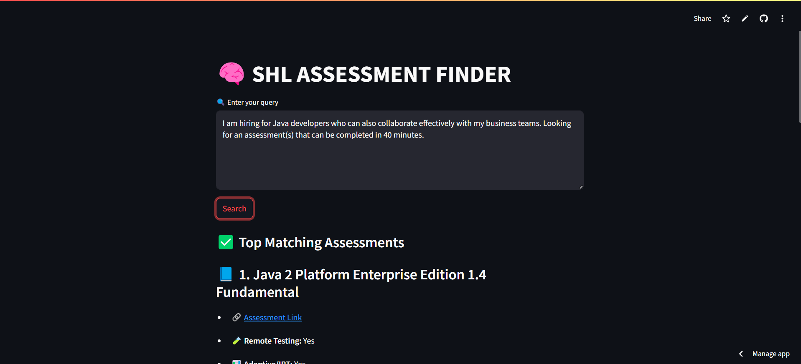
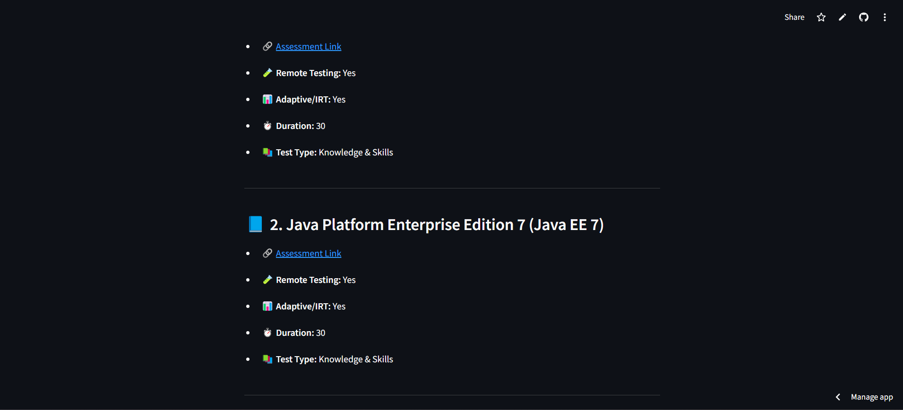

# 🧠 SHL Assessment Finder

A full-stack AI-powered tool to search and recommend SHL assessments based on user queries using LLMs and vector search.

## 🚀 Features

- Web scraping of SHL product catalog with remote/adaptive info
- CSV generation of structured assessment data
- Vector storage with Pinecone
- LLM-powered (LLaMA 3 via Groq) filtering of assessments
- Streamlit-based frontend for easy query and display
- FastAPI backend with intelligent LLM retrieval & formatting

## 🛠️ Tech Stack

- **Python**
- **Web Scraping:** `requests`, `BeautifulSoup`, `re`, `csv`
- **Frontend:** `Streamlit`
- **Backend API:** `FastAPI`, `Uvicorn`, `LangChain`
- **LLM Integration:** `ChatGroq` (LLaMA 3-70B)
- **Vector Database:** `Pinecone`, `PineconeEmbeddings`
- **Prompt Engineering:** LangChain `PromptTemplate`
- **Deployment Ready:** Compatible with Railway or localhost

## 📥 Installation & Usage

1. **Clone this repo and install dependencies**  
   ```bash
   git clone https://github.com/your-username/SHL-Assessment-Finder.git
   cd SHL-Assessment-Finder

   pip install -r requirements.txt
   ```

2. **Set environment variables**  
   Create a `.env` file in the root directory with the following content:
   ```env
   pinecone_api_key=your_pinecone_key
   groq_api_key=your_groq_key
   ```

3. **Run the backend server**  
   ```bash
   uvicorn main:app --reload
   ```

4. **Launch the frontend (Streamlit App)**  
   ```bash
   streamlit run streamlit_app.py
   ```

## 📁 Output

- The scraped CSV is saved as `shl_products.csv`
- Query results are shown live on the Streamlit interface

## 📬 API Endpoint

- <backend_url>/health      -gives running status(GET request)
- <backend_url>/recommend   -gives top recommendations in json format(POST request)

## 🙌 Acknowledgements

- [SHL Product Catalog](https://www.shl.com/solutions/products/product-catalog/)
- [Groq API](https://console.groq.com/)
- [Pinecone Vector DB](https://www.pinecone.io/)

## Here are some images of the working of this app.





## FrontEnd on Streamlit Cloud:
https://j6q7mqxbeur2xlmy3bhkhc.streamlit.app/

## Backend on Railways for checking API endpoints:
https://shlassessmentfinder-production.up.railway.app/

### Remark: I am using a free deployment service. If it crashes, and you are an evaluator please contact me at mohdyuman03@gmail.com.


